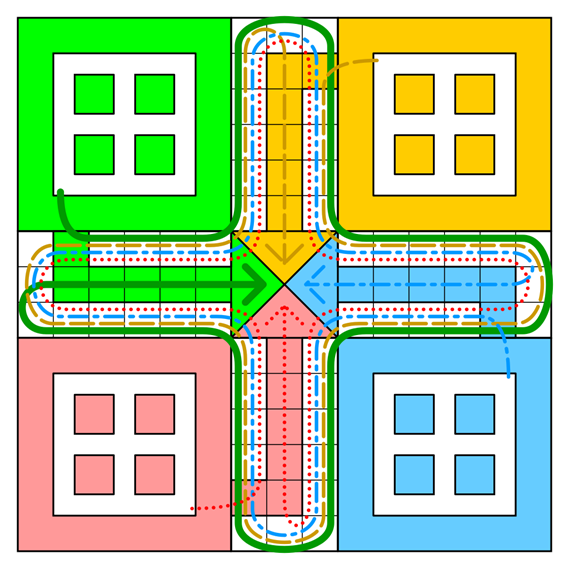
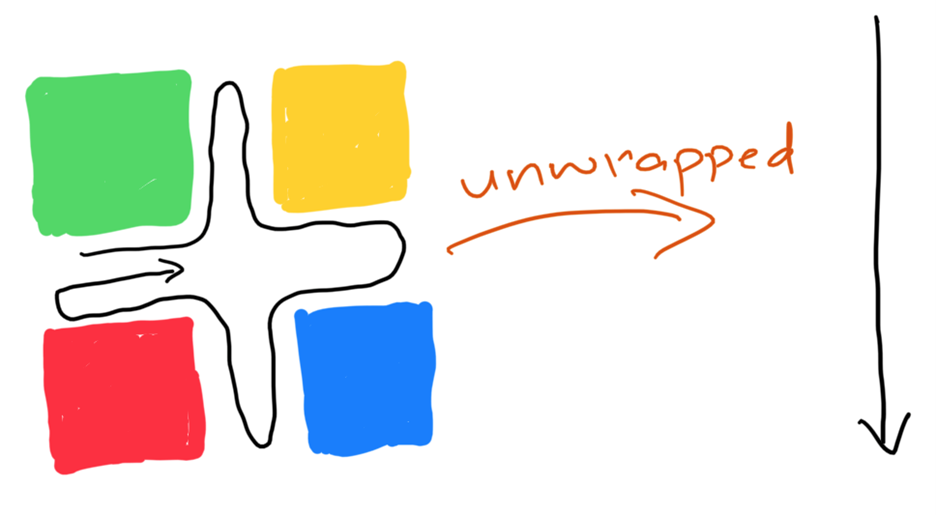
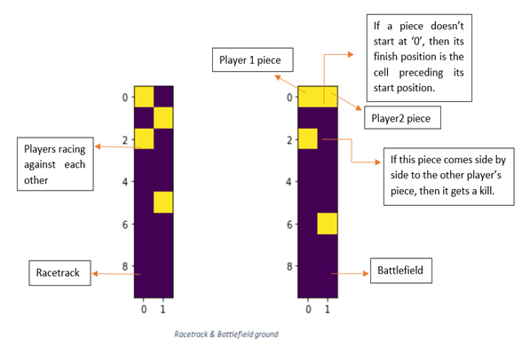
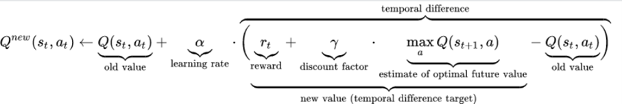

# CSE 546: Reinforcement Learning

(Spring 2022)

## Final Project Report: LUDO

Team Members

Nabeel Khan

UB Person# 50419151

[nkhan6@buffalo.edu](mailto:nkhan6@buffalo.edu)

Vivek Vijay Wadegaonkar

UB Person# 50372653

[vivekvij@buffalo.edu](mailto:vivekvij@buffalo.edu)

Babar Ahmed Shaik

UB Person#50416252

[babarahm@buffalo.edu](mailto:babarahm@buffalo.edu)

1.
# Objective

We aim to create a multi agent environment for Ludo where n number of players race around the board to finish by moving their pieces. The environment will provide feedback to the agents for their moves in terms of numerical rewards. One of the possibilities we are looking into is calculating death probability on different positions when the opponent&#39;s piece moves to the same position as the other player and introducing expected distance to the goal position which should reduce as the pieces move ahead on the board.

1.
# Methodology

The environment will be composed of different cells with different features. As in the game, there will be safe squares, unsafe squares and start positions of the agent&#39;s pieces. Killing and returning to the initial position situations is added to the game as well. We will use color scheme to highlight agent&#39;s pieces in the environment. As the pieces will move ahead, their cell numbers will be updated, and conditions will be applied as per the cell number. Killing another piece in an unsafe cell, getting reward on killing, penalty on moving back to initial position and finishing the race are the conditions we worked on.

We will be using MDP (Markov decision process) for modelling our environment&#39;s decision making. This process is based on this 4-tuple (S, A, R, T) where:

S: Set of states in the environment,

A: Set of actions possible from the state,

R: The reward the agent will get after executing certain action,

T: Transition from one state to another when certain action is executed.

The reward should be increasing as the pieces move closer to their goal position. The reward function will be defined based on some conditions like distance from the goal position, killing another piece, for entering the same color path and reaching the goal position. Some path planning algorithms will be designed to update the pieces positions in different types of cells. The game will be finished once either piece from same group reaches the goal position.

1.
# Implementation

## 3.1 Ludo

Ludo is a 2 to 4 player strategic board game in which players race their four pieces from start to finish based on a single die roll.

Special areas of the Ludo board are typically colored bright yellow, green, red, and blue. Each player is assigned a color and has four pieces in their color. The board is normally square with a cross-shaped play space, with each arm of the cross having three columns of squares, usually six per column. The middle columns usually have five squares colored; these represent a player&#39;s home column. A sixth colored square not on the home column is a player&#39;s starting square. At the center of the board is a large finishing square, often composed of colored triangles atop the players&#39; home columns (thus depicting &quot;arrows&quot; pointing to the finish).

Players alternate turns in a clockwise direction after rolling a die. A player must roll a six (bonus number) to put a piece into play from its yard to its starting square. Players can draw a piece from home every time they get a six unless their home is empty or move a piece six times. Rolling 6 results earns a player bonus roll in that turn.

Players must always move a piece according to the die value rolled. Once players have one or more pieces in play, they select a piece and move it forwards along the track the number of squares indicated by the die. If an opponent&#39;s piece is blocking the pathway, the player must land in the same space as the piece to capture it. Players cannot move past that piece. Passes are not allowed; if no move is possible, the turn moves to the next player.

A player&#39;s home column squares are always safe spaces, no opponent may enter them. In the home column, a player cannot jump over; after one rotation is completed, the player must enter the home and roll the exact number needed to get each token onto the home triangle.

## 3.2 Environment (Simplified Ludo)

At its core Ludo is essentially a circular racetrack, and to simplify our environment, we unwrapped the Ludo board/racetrack to a one-dimensional form as shown above. This made scaling down, tracking movements, kills a lot easier. This also turned our environment into a variation of &quot;the grid-world&quot;. Simplifying the environment is important for reducing the number of states to implement tabular methods, and to reduce the training time. The number of states is redefined to reduce complexity and numerous permutations and combinations.

The choice of which piece to move is the **action space.** So, if the environment has 3 pieces per player, then there are 3 possible actions.

To visualize the environment, we have created racetrack and battleground grids on which the pieces will move. In the battleground grid the relative position of the pieces are tracked, and we get to know which pieces are following other pieces, which are getting killed and returning to the start position. When the pursuer piece comes side by side to the other player&#39;s piece, the piece being pursued is killed.

Racetrack allows us to track progress, while battlefield gives the relative positions. Since Ludo is a circular with different starting positions, we incorporated this by shifting the starting position correspondingly, and hence the difference between Racetrack and battlefield.

Racetrack and battlefield description in our environment:

We have followed the Open AI gym code structure as we did in all our assignments.

We have created _ **reset, step, render** _ functions and in addition to that we have created _ **check\_move, move** _ and _ **check\_kill** _ function to calculate moves for the player&#39;s pieces and check if any piece is getting killed by other player&#39;s piece.

All safe spots on the racetrack are defined at positions [0, 5, 6, 11]. Home state is -1 and target state is length of board +1 for all the pieces. State vector is given as [[position vector for all pieces], dice\_face] so it should look like [[1,3,2, -1], 2].

By default, when dice is rolled every player can move one piece by dice face value but when dice face value is the bonus number which is the highest value of the dice face value then that player can perform 2 moves just like in real Ludo game. In _ **check\_kill** _ function first we check if the piece is at an unsafe location. If yes, then the pursuing another player&#39;s piece can kill it if it comes to the same position. The actual reward given to the agent is when its piece reaches the finishing position i.e., when it completes the race. But while experimenting with different variations in Q-learning implementation, we have allotted rewards once a kill is done based on the distance between the pursuer piece and the evader piece. The reward awarded is the distance value between those two pieces&#39; position.

## 3.3 Algorithms implemented on Environment

**Solving using Tabular Method**

**Q-Learning:**

Q-learning is a model-free reinforcement learning algorithm to learn the value of an action in a particular state. It does not require a model of the environment (hence &quot;model-free&quot;), and it can handle problems with stochastic transitions and rewards without requiring adaptations.

To simplify the environment, we unwrapped the Ludo board to a one-dimensional form as shown above. This made tracking and keeping scores easier. We are utilizing a Q table to determine the agent&#39;s best action. State = , where . We have about () Statesfor the smallest environment that we have used model, similarly () for the largest environment and for the variant with 3 pieces we have () and we are using two different Q tables to determine the actions of our agents. Where, the second Q table is just a flipped version of the first and doing this gives us the perspective of the second agent.

**Q Agent with Self Agent** **(Self play):**

Here 2 versions of the agent are playing Ludo. Both versions utilize the same q-table. This is achieved by shuffling the state position vector in a manner such that the position vector is from the perspective of the player making move, and as if the player making move is player 1.

After running for 100000 episodes with learning rate 0.2 and discount factor 0.9, it can be observed that the Q-agent was winning against random agent 60% of the time. It&#39;s not possible to win every time when we play against the random agent as there is randomness involved.

**Analytical Agent:** This is the rule-based version of the agent. We hardcoded the policy by calculating a score for each possible action and then choosing action with max score.

We evaluated this agent by playing against a random agent in the full-scale version of Ludo, and it won 98% of the time. However, in the downscaled version of the environment this agent won only 70% of the time, indicating the presence of randomness. We have used these results to benchmark our Q Learning Agent which won ~60% against random agent.

**Q Agent with Analytical Agent:**

Here we are running our agent in the environment with an analytical agent which computes the score for all available actions it can make and chooses the one with highest reward. Let&#39;s say if the analytical agent can take action on a piece and kill the opponent this gives the maximum reward, so the analytical agent chooses to move that piece. While a random agent can either move that piece or another one as it moves randomly without considering the reward.

When we pitched this Q learning agent vs Random agent, it won 57% of the times (in 1000 games)

Similarly,

For Analytical agent VS Random Agent,

The analytical agent was able to win 70% of the time

On Large environment,

For Analytical VS Random Agent,

The analytical agent was able to win 98% of the time

After training with analytical agent

For Q Agent VS Random Agent,

The Q agent was able to win 57%

After training with self-play

For Q Agent VS Random Agent,

The Q agent was able to win 59%

**Solving using MARL (Multiagent Reinforcement learning)**

**Actor-Critic Algorithm:**

Actor critic consists of 2 sets which are actor and critic, actor here does the function of updating policy parameters which is based on the feedback provided by the critic. Critic has the function of updating the value function. Actor-critic follows the approximate policy gradient which is as follows:

From among the listed algorithms in the problem statement, we have used Advantage Actor-Critic (A2C) algorithm. In this algorithm, agent&#39;s TD error is calculated. Critic returns the state value after evaluating the action taken by the actor. Returning state values is the process of learning for the critic about which state is good and which is bad. Critic uses policy evaluation (e.g. MC or TD learning) to estimate Qπ(s, a), Aπ(s, a) or Vπ(s). Here, we have implemented Temporal Difference Advantage.

- **Implementation:**

We have used 2 players and 4 pieces each to train our analytical agent and Actor critic agent. As we have increased number of pieces here, the randomness is decresed as more number of pieces lets the agent have more control on movement of the pieces.

The following hyperparameters were used to train our model:

Discount factor = 0.9

Num of episodes = 10000

ActorLearning rate = 0.00001

Critic learning rate = 0.0005

Loss function = MSELoss

Layer1 Size = (State size = 18 ,64)

Layer2 Size (actor layer) = (64 ,128)

Layer3 Size (critic layer) = (128,128)

Layer4 Size (128, no of actions= 1)

- **Performance Observation:**

So, we first created our analytical agent with mathematical rules to play in our Ludo environment. The anaytical agent performed well and gained 99% win score. When we trained and tested our Actor critic agent with analytical agent, it was able to gain around 64% to 66 % win score and that seems good.

- **Visualization**

The visualization shows when a piece kills enemy the environment displays a message &#39;BOOM&#39;.

**Team Contribution:**

| **Team Member** | **Project Part** | **Contribution %** |
| --- | --- | --- |
| Nabeel Khan | Research, Q Learning, Actor Critic, Report | 50 |
| Vivek V. Wadegaonkar | Research, Q Learning, Actor Critic, Report | 25 |
| Babar Ahmed Shaik | Research, Q Learning, Actor Critic, Report | 25 |

**References**

- [https://www.researchgate.net/publication/352181948\_Multi-agent\_Ludo\_Game\_Collaborative\_Path\_Planning\_based\_on\_Markov\_Decision\_Process](https://www.researchgate.net/publication/352181948_Multi-agent_Ludo_Game_Collaborative_Path_Planning_based_on_Markov_Decision_Process)
- [https://ieeexplore.ieee.org/document/6374142](https://ieeexplore.ieee.org/document/6374142)
- [https://ieeexplore.ieee.org/document/6031999](https://ieeexplore.ieee.org/document/6031999)
- [https://en.wikipedia.org/wiki/Q-learning](https://en.wikipedia.org/wiki/Q-learning)
